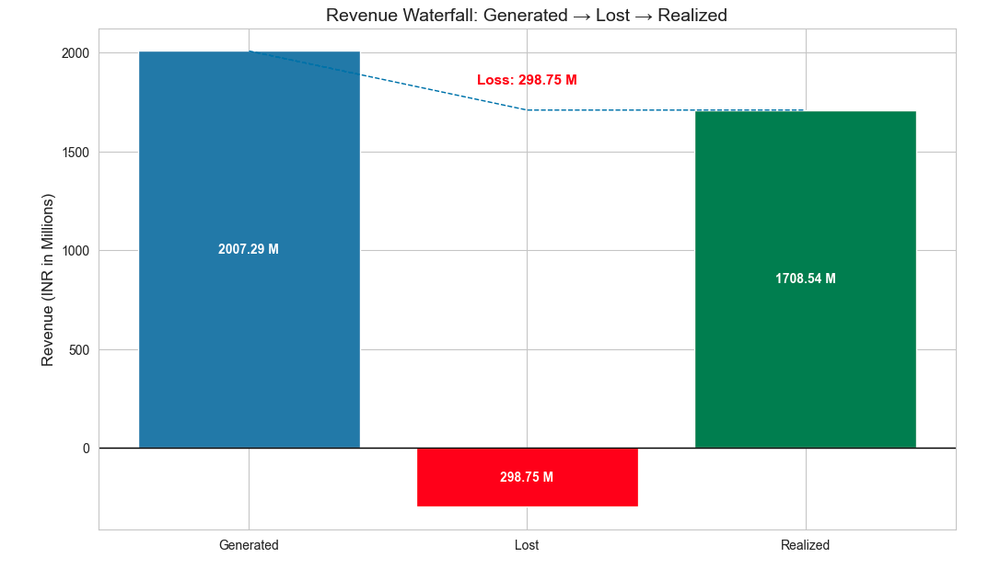
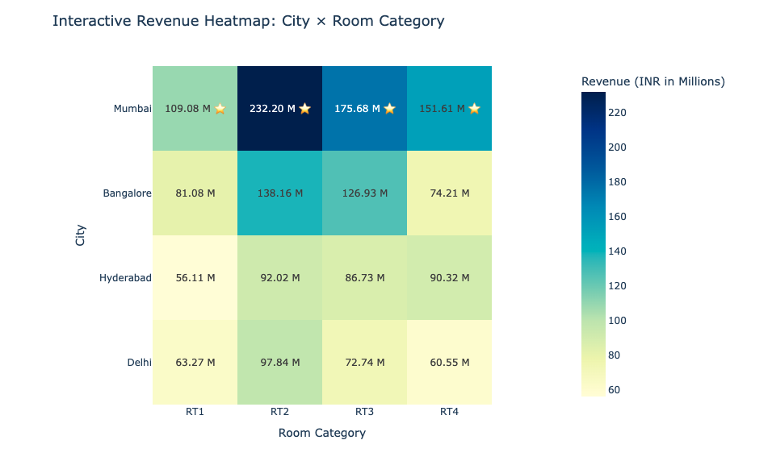
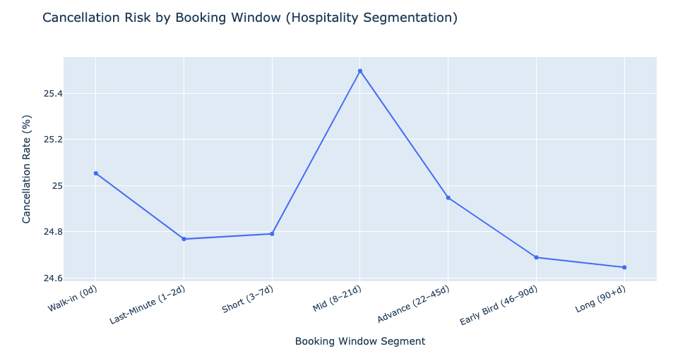

# **Exploratory Data Analysis in Hospitality Domain**

## Project Highlights
- Conducted end-to-end EDA on hospitality booking data to investigate revenue decline.
- Built advanced visual analytics including Revenue Waterfall, City × Room Category Heatmap, and Lead-Time Cancellation Risk segmentation.
- Identified revenue leakage drivers, underperforming city-room segments, and high-risk booking windows.
- Delivered actionable recommendations to improve revenue realization and occupancy stability.

---

## 🏨 Business Problem
AtliQ Grands (a premium hotel chain) has been experiencing a decline in revenue and competitive market position across multiple cities.

Management suspects that revenue loss is driven by factors such as:

- revenue leakage due to cancellations
- city-level demand variation
- room category performance imbalance
- booking lead-time behaviors influencing cancellation risk

---

## 🎯 Analytics Objective
The goal of this project is to apply hospitality revenue analytics and EDA techniques to answer strategic business questions such as:

- How much revenue is being lost due to cancellations and unrealized bookings compared to total generated revenue?
- Which cities are contributing most to revenue decline and underperformance?
- Which room categories drive the highest and lowest revenue across different cities?
- Which booking lead-time windows have the highest cancellation risk?
- How does customer booking behavior (early vs last-minute bookings) impact revenue leakage through cancellations?

---

## 📂 Dataset Information & Credit

The dataset used in this project was provided as part of the course **Gen AI & Data Science Bootcamp**, conducted by **Codebasics**.

Full credit goes to the **Mr. Dhaval Patel** and the Codebasics team for providing the dataset and learning resources.

> **Note:** The dataset is not publicly available and is therefore not included in this GitHub repository due to sharing restrictions.

This project is created strictly for educational and portfolio demonstration purposes.

---

## 🛠 Tools & Technologies Used
- Python  
- Jupyter Notebook  
- Pandas, NumPy  
- Matplotlib, Seaborn  
- Plotly (Interactive Visualizations)

---

## 📌 Project Workflow (Notebook Tasks)

This project was implemented entirely in a Jupyter Notebook and follows these major steps:

### 1. Data Import & Exploration
- Loaded multiple hospitality datasets into Pandas DataFrames within Jupyter Notebook.
- Performed initial data inspection to understand dataset structure and dimensions.
- Conducted basic exploratory checks using functions such as:
  - shape, head(), info()
  - unique(), describe() for statistical summaries
- Analyzed categorical distributions and booking trends through:
  - value_counts() for booking status, city, room category, and platform
  - sorting and filtering using sort_values() to identify high and low-performing segments

This stage helped establish an understanding of booking patterns, revenue metrics, and key business variables.

---

### 2. Data Cleaning
To ensure reliable analysis, multiple data cleaning steps were performed:
- Removed invalid guest records where the number of guests was less than zero, as these represent data entry errors.
- Detected and treated outliers in the revenue generated column to prevent skewed financial insights.
- Identified missing values using isnull() and handled them appropriately through imputation (mean/median based on distribution).
- Filtered inconsistent operational records, such as cases where successful bookings exceeded available capacity.
- Ensured cleaned data maintained realistic hospitality constraints for accurate KPI computation.

These steps improved dataset integrity and ensured meaningful business conclusions.

---

### 3. Data Transformation & Feature Engineering (including Visualization Support)
To support KPI development and advanced visual analytics, several transformations and new features were created:
- Engineered a key hospitality metric: Occupancy Percentage, calculated using successful bookings relative to capacity.
- Converted occupancy values into percentage format for business-friendly interpretation.
- Created revenue realization metrics to compare generated vs realized revenue and quantify revenue leakage.
- Aggregated revenue and booking performance at multiple levels, including:
  - city-wise summaries
  - room-category-wise performance
  - booking platform contributions
- Built pivot-table style transformations to enable the City × Room Category heatmap visualization.
- Developed booking window (lead-time) segmentation to analyze cancellation risk across customer booking behavior groups.
- Derived revenue loss components to support the Revenue Waterfall analysis (Generated vs Realized vs Loss).

These transformations enabled deeper insights into demand patterns, revenue performance, and cancellation-driven leakage.

---

### 4. Insights Generation (Basic Insights)
Initial descriptive insights were generated to understand hotel performance trends:
- Computed the average occupancy rate across different room categories to identify high-demand segments.
- Compared occupancy patterns between weekdays and weekends to assess business vs leisure demand behavior.
- Analyzed city-level occupancy performance for the month of June to identify seasonal and geographic variation.
- Appended newly available booking data to existing datasets to maintain completeness of analysis.
- Evaluated realized revenue contributions across key dimensions, including:
  - revenue realized per city
  - revenue realized by hotel type
  - booking platform-wise revenue share (visualized using a pie chart)

These foundational insights provided the base for advanced visual analytics and strategic recommendations.

---

### 5. Key Business Insights & Creative Visualizations
To address the core revenue decline problem, advanced visual analytics were developed to uncover performance gaps and revenue leakage drivers:

#### 📊 Revenue Waterfall Analysis (Generated vs Realized vs Loss)
- Quantified the gap between expected (generated) revenue and actual (realized) revenue
- Highlighted the significant portion of revenue lost due to cancellations and unrealized bookings
- Provided a clear measure of overall revenue leakage across the business 

#### 🌍 City × Room Category Heatmap (Interactive)
- Identified which cities contribute most to revenue decline and underperformance
- Revealed room-category level demand imbalance across different markets
- Highlighted high-performing and low-performing city–room combinations for strategic focus

#### ⏳ Lead Time vs Cancellation Risk (Booking Window Segmentation)
- Analyzed how booking lead-time impacts cancellation probability
- Segmented customers into short-, medium-, and long-window booking groups
- Identified high-risk booking windows that drive cancellation-based revenue loss

These visualizations collectively explain where revenue is being lost, which segments are underperforming, and how customer booking behavior contributes to cancellations.

---

### 6. Key Takeaways & Business Recommendations
Based on the insights generated, the hotel chain can improve revenue realization through the following actions:
- Prioritize underperforming cities identified in the heatmap with targeted pricing and demand-building strategies
- Reduce revenue leakage by implementing improved cancellation policies or incentives for confirmed bookings
- Optimize room-category pricing and inventory allocation based on high- and low-demand segments across cities
- Use booking lead-time risk segmentation to proactively manage high-cancellation customer groups
- Strengthen revenue forecasting and occupancy planning by focusing on stable booking windows with lower cancellation risk 

---

### 7. Final Conclusion
This project demonstrates that the hotel’s revenue decline is driven primarily by:
- revenue leakage caused by cancellations and unrealized bookings
- uneven city-wise revenue performance and demand variation
- room-category level performance imbalance across markets
- booking lead-time patterns that significantly influence cancellation risk

By focusing on occupancy improvement, cancellation reduction, and segment-based revenue optimization, the hotel chain can enhance revenue realization and regain competitiveness in key markets.

---

